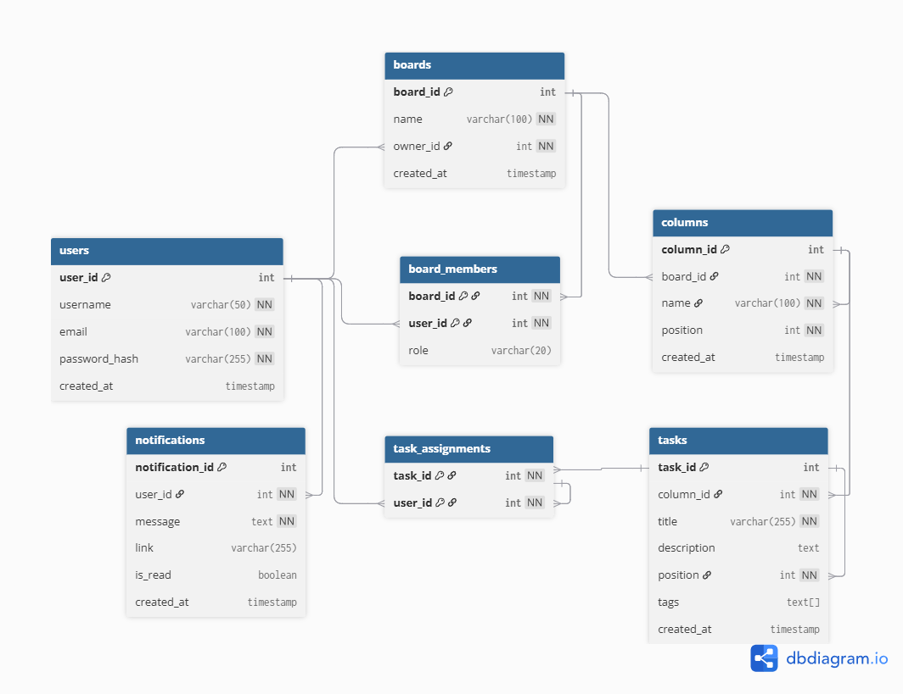

# Kanban Board System

A simple and powerful Kanban Board system built with React (Next.js), Node.js (Express), and PostgreSQL.

## Features
- User Authentication (Register/Login)
- Board Management (Create, Delete, Rename)
- Column Management (Create, Delete)
- Task Management (Create, Delete, Drag-and-drop)
- Board Invitations
- Task Assignments & Notifications

## Tech Stack
- **Frontend:** Next.js (App Router), TypeScript, Tailwind CSS, @hello-pangea/dnd, Axios, Lucide React
- **Backend:** Node.js, Express, PostgreSQL (pg), JWT, BcryptJS
- **Database:** PostgreSQL

## Setup Instructions

### Backend Setup
1. Navigate to `backend` directory:
   ```bash
   cd backend
   ```
2. Install dependencies:
   ```bash
   npm install
   ```
3. Configure your database in `.env`:
   ```env
   PORT=5000
   DB_USER=postgres
   DB_PASSWORD=postgres
   DB_HOST=localhost
   DB_PORT=5432
   DB_NAME=kanban_db
   JWT_SECRET=your_jwt_secret_key
   ```
4. Initialize the database:
   ```bash
   npm run db:setup
   ```
5. Start the server:
   ```bash
   npm run dev
   ```

### Frontend Setup
1. Navigate to `frontend` directory:
   ```bash
   cd frontend
   ```
2. Install dependencies:
   ```bash
   npm install
   ```
3. Start the development server:
   ```bash
   npm run dev
   ```
4. Access the application at `http://localhost:3000`

## Project Structure
- `backend/`: Express server, controllers, routes, and DB setup.
- `frontend/`: Next.js application, components, and API integration.

## ER Diagram


- Users

The users table stores information about registered users in the system. Each user has a unique username and email. A user can own multiple boards, be a member of multiple boards, be assigned to multiple tasks, and receive notifications.

- Boards

The boards table represents Kanban boards. Each board is owned by a single user (owner_id) and can contain multiple members and columns. When a user is deleted, all boards owned by that user are also removed due to cascading.

- Board Members

The board_members table defines a many-to-many relationship between users and boards. It allows multiple users to collaborate on a board. Each record includes a role field to specify the user’s permission level within the board. The combination of board_id and user_id serves as a composite primary key to prevent duplicate memberships.

- Columns

The columns table represents the columns within a board, such as "To Do", "In Progress", and "Done". Each column belongs to a specific board. The position field is used to maintain the order of columns for display and drag-and-drop functionality.

- Tasks

The tasks table stores individual tasks within a column. Each task belongs to one column and includes a title, optional description, position, and tags. The position field is used to maintain the order of tasks within a column.

- Task Assignments

The task_assignments table defines a many-to-many relationship between tasks and users. This allows tasks to be assigned to multiple users, and users to have multiple tasks. The combination of task_id and user_id ensures uniqueness.

- Notifications

The notifications table stores messages sent to users. Each notification belongs to a single user and contains a message, an optional link, and a read status. This allows the system to inform users about updates or actions related to boards and tasks.

## Relationships Summary
   - A user can own multiple boards (one-to-many).
   - Users and boards have a many-to-many relationship through board_members.
   - A board can have multiple columns (one-to-many).
   - A column can have multiple tasks (one-to-many).
   - Tasks and users have a many-to-many relationship through task_assignments.
   - A user can receive multiple notifications (one-to-many).